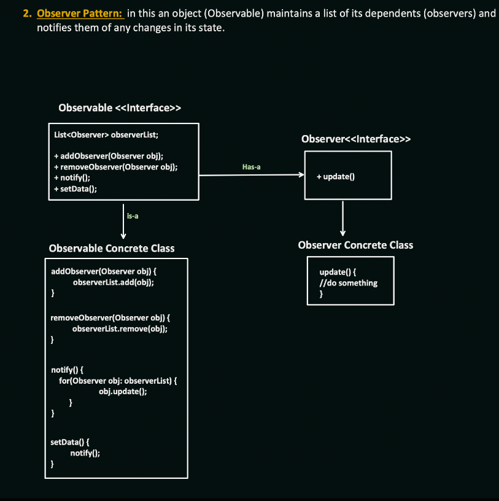

##  1. **Problem in the Past (History/Why Needed)**

Let’s say you’re building a system — like a **Stock Market App**.

###  Old way (without Observer Pattern):

Every component (Graph UI, SMS Notifier, Logger) pulls stock data **manually** again and again, asking:

> “Hey stock service, did price change?”

That means:

* Each class **polls** the data source.
* They are **tightly coupled** with the stock system.
* Updating logic becomes painful.
* Adding/removing modules is risky (more if-else or refactor needed).

---

##  2. **What Observer Pattern Solves**

It flips the control — instead of classes pulling updates…

###  The subject **pushes** updates to all listeners.

So:

* **Observable** (subject) tracks internal state.
* **Observers** (subscribers) register themselves.
* On change, **Observable notifies** all Observers.
* Each Observer handles it its own way (SMS, email, dashboard).

---

##  3. Observer Pattern — Definition

> "Define a one-to-many dependency between objects so that when one object changes state, all its dependents are notified and updated automatically."

 Used when:

* Multiple things depend on one object
* Those dependents must react to change
* Without tightly coupling them

---

##  4. How It Works (based on your diagram)

### 🔹 Interfaces:

* **`Observable` Interface**

  * Has: `addObserver()`, `removeObserver()`, `notify()`
  * Maintains a `List<Observer>`

* **`Observer` Interface**

  * Defines: `update()` — how a dependent reacts to change

---

### 🔹 Concrete Implementations:

```java
// Observer interface
public interface Observer {
    void update();
}

// Observable interface
public interface Observable {
    void addObserver(Observer o);
    void removeObserver(Observer o);
    void notifyObservers();
    void setData(String data);  // example trigger
}
```

---

### Concrete Observable

```java
public class StockService implements Observable {
    private List<Observer> observers = new ArrayList<>();
    private String stockPrice;

    @Override
    public void addObserver(Observer o) {
        observers.add(o);
    }

    @Override
    public void removeObserver(Observer o) {
        observers.remove(o);
    }

    @Override
    public void notifyObservers() {
        for (Observer o : observers) {
            o.update();
        }
    }

    @Override
    public void setData(String data) {
        this.stockPrice = data;
        notifyObservers();  // this triggers all
    }

    public String getStockPrice() {
        return stockPrice;
    }
}
```

---

###  Concrete Observers

```java
public class SMSNotifier implements Observer {
    private Observable stockService;

    public SMSNotifier(Observable stockService) {
        this.stockService = stockService;
        stockService.addObserver(this);
    }

    @Override
    public void update() {
        System.out.println("SMS: Stock updated!");
    }
}

public class DashboardUI implements Observer {
    private Observable stockService;

    public DashboardUI(Observable stockService) {
        this.stockService = stockService;
        stockService.addObserver(this);
    }

    @Override
    public void update() {
        System.out.println("UI updated with new stock info.");
    }
}
```

---

### 🔹 Usage

```java
public class Main {
    public static void main(String[] args) {
        StockService stockService = new StockService();

        new SMSNotifier(stockService);
        new DashboardUI(stockService);

        stockService.setData("NIFTY: 24,600"); // Notifies all observers!
    }
}
```

---

##  5. How Decoupled It Is

**Without Observer Pattern:**

* `StockService` must know about `DashboardUI`, `SMS`, `EmailNotifier` etc. →  tight coupling

**With Observer Pattern:**

* `StockService` just knows it has **some Observers**
* Doesn’t care what they do — it's just:

  ```java
  observer.update(); // loose contract
  ```

This is called **loose coupling** → each module is replaceable.

---

##  6. Real-World Examples

 Used in:

* GUI frameworks: Button click → observers listen
* Spring Events: `@EventListener`
* Kafka consumers (pattern-wise)
* ReactJS state system
* Notification systems
* Weather station app
* Chat apps (observer = all connected clients)

---

##  Summary:

| Feature                   | Before (Tight Coupling) | After (Observer Pattern) |
| ------------------------- | ----------------------- | ------------------------ |
| Flexibility               | ❌ Low                   | ✅ High                   |
| Easy to Add/Remove Module | ❌ No                    | ✅ Yes                    |
| Code Duplication          | ❌ Yes                   | ✅ Avoided                |
| Open/Closed Principle     | ❌ Broken                | ✅ Followed               |
| Reusability               | ❌ Low                   | ✅ High                   |

---