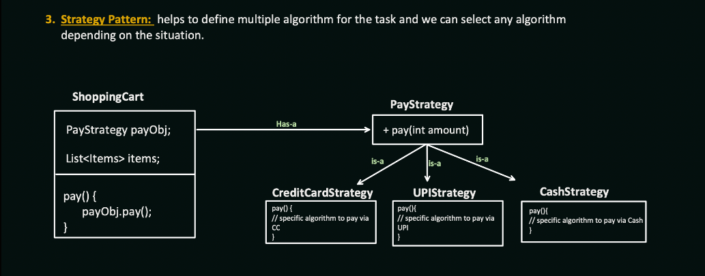

## **Strategy Pattern – Overview**

### **Intent**

The Strategy Pattern helps define a **family of algorithms**, encapsulate each one, and make them **interchangeable**. This allows the algorithm to vary **independently from clients** that use it.

---

### **Problem Statement (Before Strategy Pattern)**

In a typical payment flow within an e-commerce system:

* `ShoppingCart` needs to support multiple payment methods like **Credit Card**, **UPI**, and **Cash**.
* Without Strategy Pattern, the logic for all payment methods ends up inside the `ShoppingCart` class.
* This leads to:

  * Code duplication
  * Difficult testing
  * Violation of Open/Closed Principle
  * Tight coupling between payment logic and business flow

---

### **Solution (Using Strategy Pattern)**

Define a common **PayStrategy** interface:

```java
public interface PayStrategy {
    void pay(int amount);
}
```

Implement concrete strategies:

```java
public class CreditCardStrategy implements PayStrategy {
    public void pay(int amount) {
        // specific logic for credit card payment
    }
}

public class UPIStrategy implements PayStrategy {
    public void pay(int amount) {
        // specific logic for UPI payment
    }
}

public class CashStrategy implements PayStrategy {
    public void pay(int amount) {
        // specific logic for cash payment
    }
}
```

In the `ShoppingCart` class, inject the desired strategy:

```java
public class ShoppingCart {
    private PayStrategy payStrategy;

    public ShoppingCart(PayStrategy payStrategy) {
        this.payStrategy = payStrategy;
    }

    public void payBill(int amount) {
        payStrategy.pay(amount);
    }
}
```

Usage:

```java
PayStrategy strategy = new CreditCardStrategy();
ShoppingCart cart = new ShoppingCart(strategy);
cart.payBill(1000);
```

---

### **Benefits of Strategy Pattern**

| Benefit                   | Description                                                           |
| ------------------------- | --------------------------------------------------------------------- |
| **Open/Closed Principle** | New payment methods can be added without modifying existing logic     |
| **Loose Coupling**        | `ShoppingCart` does not depend on concrete implementations of payment |
| **Testability**           | Each strategy can be unit tested independently                        |
| **Runtime Flexibility**   | Strategy can be changed dynamically at runtime                        |

---

### **Real-World Use Cases**

* Payment processing (UPI, Card, NetBanking, Wallet)
* Sorting strategies (bubble, quick, merge sort)
* Compression (ZIP, RAR, GZIP)
* Authentication providers (LDAP, OAuth, JWT)
* Notification types (Email, SMS, Push)

---

### **Key Characteristics**

* Uses **composition over inheritance**
* The client class (e.g., `ShoppingCart`) is **decoupled** from specific algorithm implementations
* Strategies are **plug-and-play**

---

### **Relation to Other Patterns**

* Often used alongside **Factory Pattern** to choose the right strategy
* Supports **Dependency Inversion Principle (D in SOLID)** by depending on an abstraction
